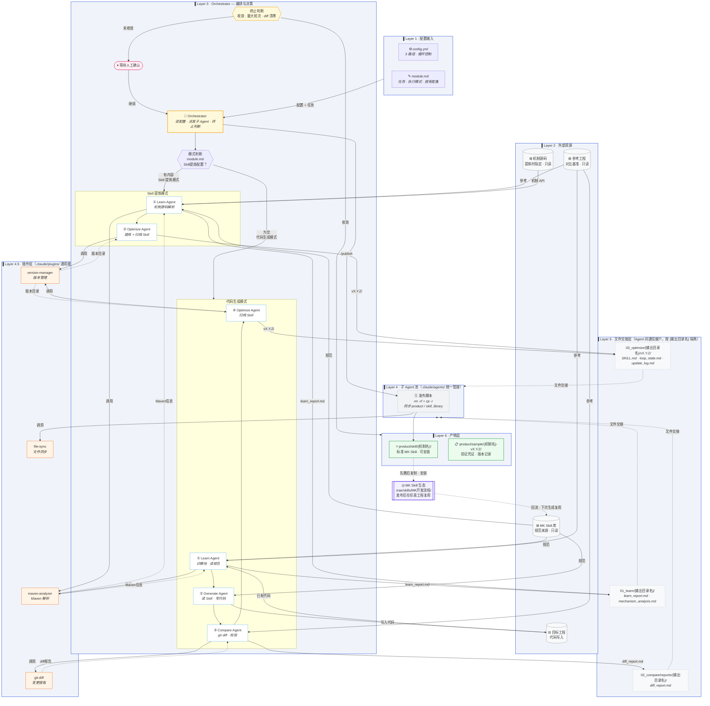
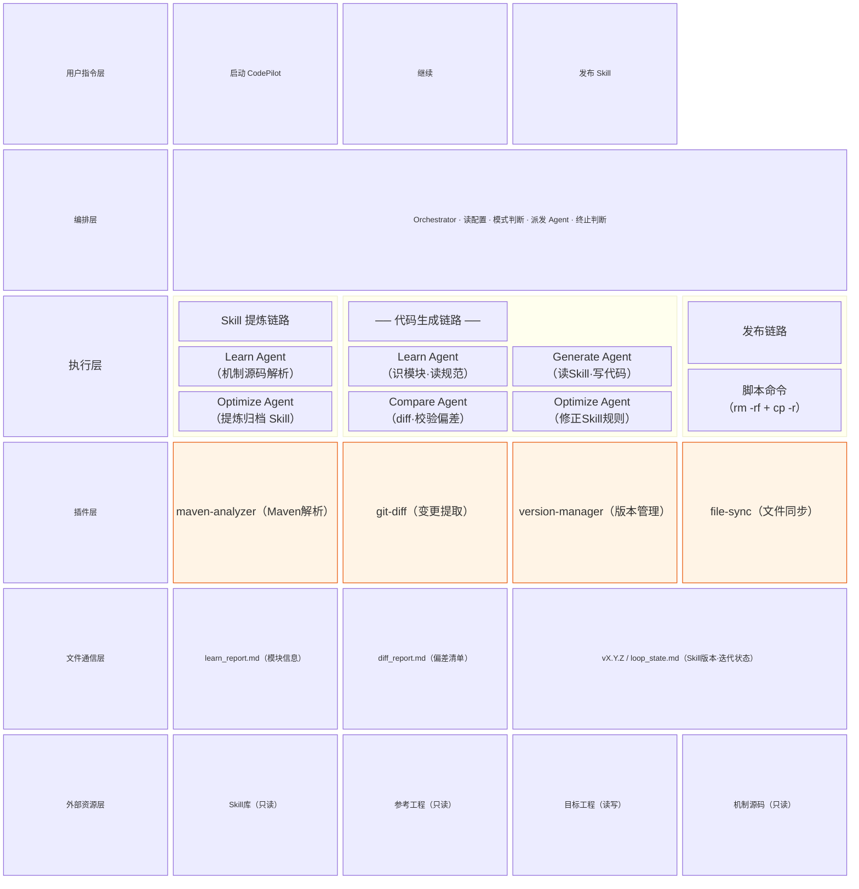

# CodePilot Hub

以 **Skill 自进化**为核心目标的，一套以 Claude Agent 为引擎、代码生成为验证手段，让 Skill 在闭环迭代中自动收敛为高质量可复用规范的自进化工程框架。

通过「提炼 Skill → 生成代码验证 → 对比校验 → 反馈优化」的闭环迭代，驱动 Skill 持续收敛为高质量可复用规范。**后端代码生成是验证手段，Skill 是最终产物。**

---

## 工程产物

| 产物 | 性质 | 位置 |  用途 |
|------|------|------|------|
| **后端 Skill** | 核心产物 | `product/skill/{模块名}后端部署/` | 标准 MK Skill，`cp` 到 Skill 库后可在任意工程复用 |
| **验证代码记录** | 验证凭证 | `product/sample/{模块名}-vX.Y.Z/` | 证明 Skill 能产出符合规范的真实代码 |

---

## 总架构设计



---

## Agent 架构分层



---

## 快速开始

### 前置条件

| 必需 | 说明 |
|------|------|
| MK Skill 库 | 克隆自 MK 平台 Skill 仓库 |
| 参考工程 | 一个完整的 MK 后端模块工程，作为对比基准和 Skill 提炼案例 |
| 目标工程 | 已有多模块脚手架（`-api` / `-core` / `-client`）的 MK Maven 工程 |
| 机制源码 | MK 平台机制模块源码，Skill 提炼时用于明确机制能力边界 |

> 目标工程无脚手架时，先发送：`请按照 MK后端模块脚手架 为 {模块名} 创建脚手架`

---

### 第一步：克隆本工程

```bash
git clone <本仓库地址>
cd CodePilot
```

---

### 第二步：配置 3 个路径

打开 `.claude/config.yml`，修改 **★ 新手配置区** 的 3 个路径：

```yaml
paths:
  target_project:    /你的路径/mk-km-xxx      # 生成代码写入此处
  reference_project: /你的路径/mk-km-review   # 对比基准 + Skill 提炼案例
  skill_library:     /你的路径/.trae/skills   # MK 规范来源
```

**只改这 3 行，其余不动。**

> 机制源码路径在 `00_workspace/input/module.md` 的 Skill 提炼配置里按任务填写，支持每次指定不同机制。

---

### 第三步：填写任务

打开 `00_workspace/input/module.md`，按目标选择模式：

**模式一 · 代码生成**（用已有 Skill 生成 Java 代码，每轮反馈优化 Skill）
```markdown
- [x] 增量项目

## 本次任务
为 KmNews 模块接入权限机制，补全 AuthRoles / AuthValidators 定义
```

**模式二 · Skill 提炼**（从机制源码提炼可复用规范，跳过代码生成）
```markdown
## Skill 提炼配置
- 分析子模块：
- 机制源码：/你的路径/mk-sys-auth
- 输出目录名：MK后端权限机制部署
```

> 模块名称、Key、包路径由 Agent 自动识别，无需手动填写。

---

### 第四步：启动

在 Claude Code 中发送：

```
启动 CodePilot
```

Agent 自动读取配置 → 识别任务模式 → 执行完整流程 → 每轮结束等待确认。

---

### 第五步：查看结果

```bash
cd /你的目标工程路径
git diff --stat   # 查看生成了哪些文件（代码生成模式）
```

Skill 产物在 `product/skill/`，确认质量后执行发布：

```
/publish
```

---

## 工程结构

所有中间产物均按 `{输出目录名}` 隔离，多机制并行时互不干扰。

```
CodePilot/
├── .claude/
│   ├── config.yml                    ★ 只改这里的 3 个路径
│   ├── instructions.md                 Orchestrator 执行指令（无需改动）
│   ├── commands/                       自定义交互指令集
│   │   └── publish.md                  /publish — 发布 Skill
│   ├── plugins/                        第三方能力插件（通用·可复用）
│   │   ├── maven-analyzer.md           Maven 多模块工程信息提取
│   │   ├── git-diff.md                 git diff 执行与结构化输出
│   │   ├── version-manager.md          vX.Y.Z 目录 + latest 软链接管理
│   │   └── file-sync.md                先删后复制文件同步
│   ├── agents/                         子 Agent 提示词（MK 业务逻辑）
│   │   ├── learn-agent.md              学习阶段：模块识别 + 规范摘要
│   │   ├── generate-agent.md           生成阶段：读 Skill · 写代码
│   │   ├── compare-agent.md            校验阶段：git diff · 对比报告
│   │   └── optimize-agent.md           优化阶段：Skill 归档 · 状态更新
│   └── skills/
│       ├── project_skill.md            Agent 自动维护的项目规范
│       ├── skill-gen-prompt.md         Skill 提炼三阶段提示词
│       └── references/                 命名约定与机制分类清单
│
├── 00_workspace/input/
│   └── module.md                     ★ 每次任务只填这里
│                                       生成代码直接写入 target_project（见 config.yml）
│
├── 01_learn/
│   └── {输出目录名}/                   学习报告 · 机制解析（每机制隔离）
│       ├── learn_report.md             代码生成模式：模块识别结果
│       └── mechanism_analysis.md       Skill 提炼模式：机制接入清单
│
├── 02_compare/reports/
│   └── {输出目录名}/                   diff 校验报告（每机制隔离）
│       └── diff_report.md
│
├── 03_optimize/
│   └── {输出目录名}/                   Skill 迭代版本（每机制隔离）
│       ├── loop_state.md               迭代状态（轮次、收敛判断）
│       ├── update_log.md               进化日志
│       ├── latest -> vX.Y.Z/           软链接，始终指向最新版本
│       ├── v1.0.0/
│       └── vX.Y.Z/
│
└── product/
    ├── skill/
    │   └── {机制名}/                 ★ 核心产物：标准 MK Skill（可安装）
    └── sample/
        └── {机制名}-vX.Y.Z/            验证凭证：版本记录
```

---

## 常见问题

**Q：Skill Loop 跑完一轮后怎么继续？**
回复「继续」，Agent 读取 `loop_state.md` 从上次断点接着跑，不会重头来过。

**Q：只想提炼 Skill，不生成代码？**
在 `module.md` 填写 `Skill 提炼配置` 区块，Agent 自动走提炼路径，跳过代码生成。

**Q：MK Skill 库更新了怎么办？**
```bash
cd /你的Skill库路径 && git pull
# 下次启动 CodePilot 自动读取最新规范
```

**Q：生成代码有问题怎么办？**
在 `module.md` 补充说明，重发「启动 CodePilot」，Agent 读取已有代码增量修正。

**Q：两种模式有什么区别？**
- **Skill 提炼模式**：`module.md` 填写 `Skill 提炼配置` 区块，从机制源码提炼规范，不生成业务代码，适合首次建立 Skill。
- **代码生成模式**：`module.md` 填写 `本次任务`，读取已有 Skill 生成 Java 代码，每轮 diff 对比后反馈优化 Skill，适合落地到具体工程。

**Q：如何发布 Skill 到 Skill 库？**
Skill 收敛后发送 `发布 Skill` 或直接输入 `/publish`，自动执行先删后复制同步至 `product/skill/` 和 `skill_library`。

---

## 外部资源说明

| 资源 | 配置位置 | 权限 | 使用阶段 |
|------|---------|------|---------|
| 目标工程 | `config.yml → paths.target_project` | 读写 | Generate：代码写入目标 |
| 参考工程 | `config.yml → paths.reference_project` | 只读 | Learn / Compare / Skill 提炼案例 |
| Skill 库 | `config.yml → paths.skill_library` | 只读 | Learn / Generate：规范来源 |
| 机制源码 | `module.md → Skill提炼配置 → 机制源码` | 只读 | Skill 提炼：按任务指定，可每次不同 |
